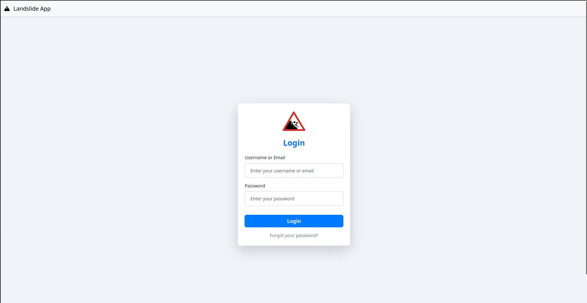
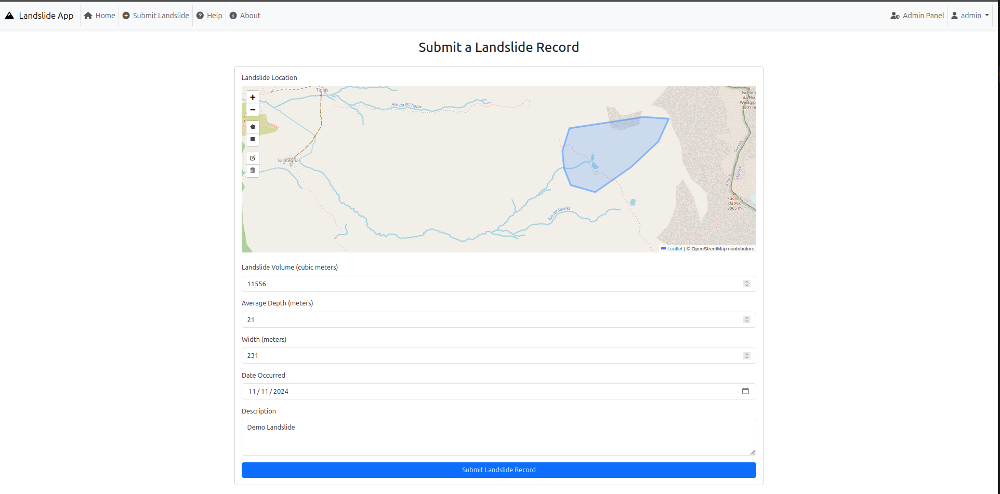
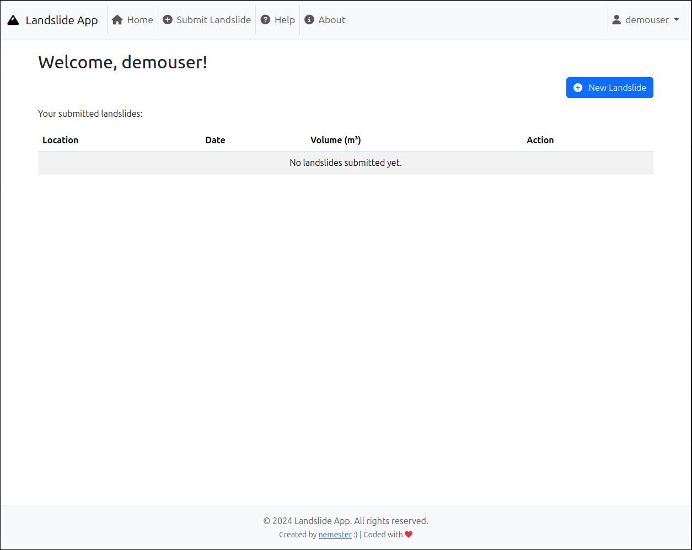
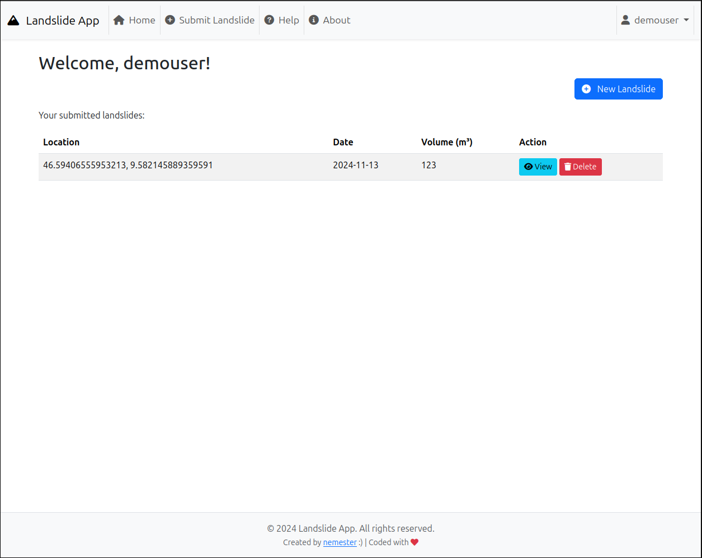
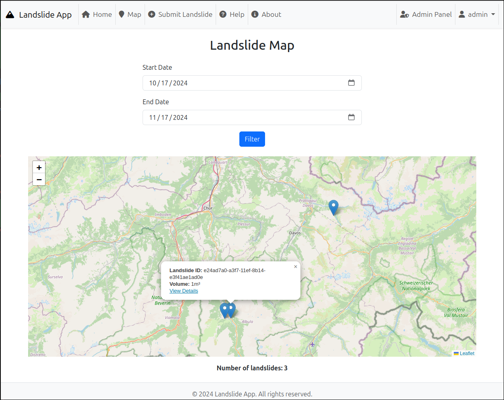
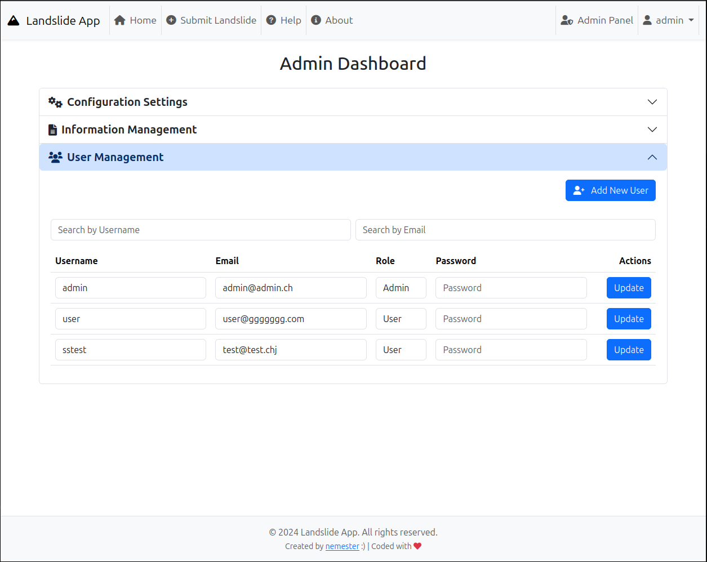
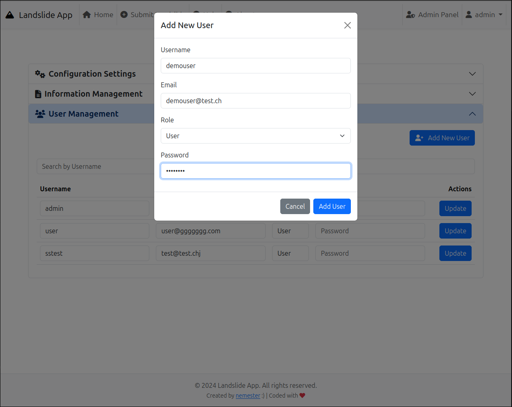
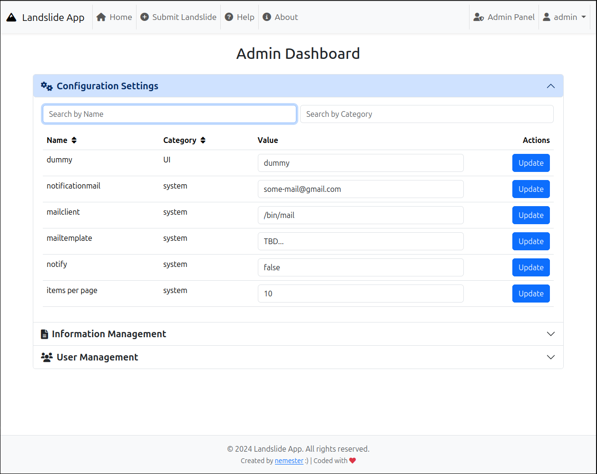

# Landslide App

| :warning: WARNING           |
|:----------------------------|
| THIS PROJECT IS STILL UNDER DEVELOPMENT! DO NOT CLONE/INSTALL IT UNLESS YOU'RE FAMILIAR WITH THE TECH STACK AN THE USED LAYERED ARCHITECTURE      |


A web application for managing and tracking landslide data. 

## Table of Contents

1. [Project Overview](#project-overview)
2. [Features](#features)
3. [Tech Stack](#tech-stack)
4. [Folder Structure](#folder-structure)
5. [Installation](#installation)
6. [Database Models](#database-models)
7. [Customization](#customization)
8. [Screenshots](#screenshots)

---

## Project Overview

The application allows users to submit landslide information, view details, and manage configurations. Admin users can manage other users, update configuration settings, and access detailed reports.

### Features
- **User Authentication**: Users can log in, register, and manage their profiles.
- **Landslide Submission**: Users can submit landslide data (location, volume, depth, etc.).
- **Admin Dashboard**: Admin users can:
  - Manage users (edit, disable, or delete users).
  - Manage configuration settings stored in the database.
  - View and update landslide data.
- **About Page**: Displays application information, such as version and build date.

## Tech Stack

- **Node.js**: JavaScript runtime environment for server-side development.
- **Express**: Web application framework for Node.js.
- **Sequelize**: Promise-based Node.js ORM for interacting with the database.
- **Handlebars**: Templating engine for rendering HTML views.
- **Bootstrap**: Front-end framework for responsive, mobile-first web design.
- **Leaflet**: Open-source JavaScript library for interactive maps.
- **SQLite / PostgreSQL**: Database for storing landslide and user information.

## Folder Structure
```plaintext
landslide-app/
│
├── config/
│   ├── logger.js                   # Logging
│   ├── serverInit.js               # Set up the server
│   ├── viewEngine.js               # Set up handlebars
│   ├── dbInit.js                   # Database initialization
│   └── database.js                 # Database connection and Sequelize setup
├
│── controllers/                    # Contains the controllers (logic)
│
├── docs/	                        # Documentation
│
├── models/                         # Sequelize models
│
├── public/                         # public assets / static files
│
├── routes/                         # Route handlers
│
├── services/	                     # Services (model manipulations)
│
├── utils/	                        # Some useful stuff
│
├── views/                          # Handlebars views
│
├── .env                            # Environment variables
├── .gitignore		                  # You should know what this is ;)
├── app.js                          # Main entry point for the app
├── package.json                    # You should also know what that is ;)
└── README.md                       # This file
```


## Installation

1. Clone the repository to your local machine.
   

bash
   git clone https://github.com/your-repo/landslide-app.git


2. Navigate to the project directory:
   

bash
   cd landslide-app


3. Install dependencies (if applicable) and ensure bootstrap.min.css, main.css, leaflet.css, and font-awesome.css are correctly linked.
   

bash
   npm i


4. Adapt the environment variables to your needs

## Database Models

The app uses Sequelize to manage the database, with the following models:

- **User**: Stores user information (username, email, password, role).
- **Landslide**: Stores landslide details (location, volume, depth, etc.).
- **Configuration**: Stores app configuration settings (such as app version, developer info).
- **Information**: Stores static information about the app (such as version, build date).

You can see the schema and relationships for each model in the models directory.


## Customization

To make the app your own, adjust the following sections:

- **Logo**: Replace /images/rocks-falling-sign-icon.png with your own logo.
- **Colors**: Modify the colors in main.css to better fit your brand.
- **Icons**: Use Font Awesome for custom icons or change the navbar-brand icon.
- **Text**: Adjust labels in login.handlebars and navbar links for your specific needs.

## Backlog

- JWT signed token
- Improve logging
- Refactor Services/Controllers
- Add pagination
- Improve security (helmet config)

## Screenshots

### Login


### Submit new landslide


### Userdashboard (no landslides)


### Userdashboard


### Landslide map


### Admin: Usermanagement


### Admin: Add user


### Admin: Config


---
